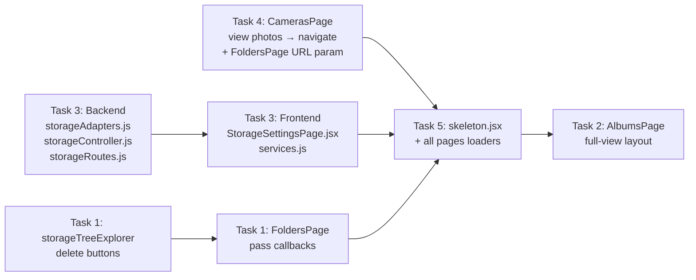

# Implementation Plan & Prompt — Studio App Feature Updates

---

## Summary of Requested Changes (Decoded)

After fully analysing the codebase, the 5 concrete features the user wants are:

| # | Feature | Area |
|---|---------|------|
| 1 | **Delete files & folders from the storage tree** with confirmation modal | `FoldersPage` / `StorageTreeExplorer` + backend `folderController` |
| 2 | **Photo Library (Albums) page full-view expansion** — currently small/cramped | `AlbumsPage.jsx` UI overhaul |
| 3 | **Storage page: per-provider live storage usage** — used vs available (GB/TB) with progress bars | `StorageSettingsPage` + backend `storageController` + `storageAdapters` |
| 4 | **Camera page "View Photos" → navigate to Photo Library** instead of opening a tiny modal (performance + UX) | `CamerasPage.jsx` |
| 5 | **No loading blank screens / UI freezes** — loading states must be skeleton-based, never blank | All pages |

---

## Codebase Architecture Map

```
d:\Personal\Studio\
├── apps/
│   ├── backend/src/
│   │   ├── controllers/
│   │   │   ├── storageController.js   ← list, create, update, remove, testConnection
│   │   │   ├── folderController.js    ← tree, delete, assets, server-explorer
│   │   │   └── cameraController.js   ← cameras, assets, upload
│   │   ├── services/
│   │   │   └── storageAdapters.js    ← readObject, writeObject, deleteObject, testConnection
│   │   └── routes/
│   │       ├── storageRoutes.js      ← GET /providers, POST /providers/:id/test
│   │       └── folderRoutes.js
│   └── frontend/src/
│       ├── api/services.js            ← storageApi, foldersApi, camerasApi
│       ├── App.jsx                    ← routes: /studio/albums, /studio/storage, /studio/cameras
│       ├── pages/studio/
│       │   ├── storage/StorageSettingsPage.jsx   ← 681 lines, needs storage stats
│       │   ├── folders/FoldersPage.jsx            ← 1240 lines, delete file/folder needed
│       │   ├── cameras/CamerasPage.jsx            ← 1340 lines, view photos → navigate
│       │   └── albums/AlbumsPage.jsx              ← 72KB, needs full-view redesign
│       └── components/gallery/
│           ├── StorageTreeExplorer.jsx   ← 55KB, asset/folder tree, delete actions needed
│           └── MediaBrowser.jsx          ← photo lightbox/grid
```

---

## Feature 1: Delete Files & Folders from Storage Tree

### Current State
- `FoldersPage.jsx` has `confirmDeleteFolder()` which calls `foldersApi.delete(id)` — **folder delete works**.
- `foldersApi.deleteAsset(id)` exists in `services.js` — **individual asset delete API exists**.
- **Missing**: The `StorageTreeExplorer` component (55KB) does NOT have a delete button/action wired for individual files, and there's no bulk-delete UI.
- **Missing**: No delete button is surfaced in the file grid inside the `StorageTreeExplorer`.

### Implementation Plan

**Backend** — No new endpoints needed. `DELETE /studio/folders/assets/:id` already exists.

**Frontend changes:**

1. **`StorageTreeExplorer.jsx`** — Add a delete icon button on each asset card (trash icon, red). Show a `ConfirmModal` before deleting. After confirmation, call `foldersApi.deleteAsset(asset.id)` and refresh the explorer.

2. **`StorageTreeExplorer.jsx`** — For folder-level nodes in the left tree sidebar, add a right-click or hover trash icon that calls `foldersApi.delete(folderId)` with confirmation.

3. **`FoldersPage.jsx`** — The "Folders" tab already has delete. Ensure the "File Server & Camera Tree" tab (`StorageTreeExplorer`) passes `onDeleteAsset` and `onDeleteFolder` callbacks.

4. **State**: Add `deleteAssetModal` (null or asset object) state in the component. Show `ConfirmModal` with danger variant.

---

## Feature 2: Photo Library (Albums Page) Full-View Expansion

### Current State
- `AlbumsPage.jsx` is 72KB — a very large page with album grid and lightbox.
- The user says it looks "small page" — likely the album grid thumbnails are too small, the layout is cramped, or the page doesn't use the full width well.

### Implementation Plan

1. **Grid sizing**: Change album cards from `grid-cols-2 sm:grid-cols-3` → `grid-cols-1 sm:grid-cols-2 lg:grid-cols-3 xl:grid-cols-4` with larger card aspect ratios.
2. **Thumbnail size**: Album cover thumbnails should use `aspect-[4/3]` or `aspect-video` instead of small square, showing more of the photo content.
3. **Expand lightbox/MediaViewer**: When clicking a photo in the album view, it should open a full-screen lightbox modal that uses `100vw x 100vh` space.
4. **Page layout**: Remove unnecessary padding/margins that constrain width. Use `max-w-none` or at least `max-w-7xl`.
5. **Album detail view**: When opening an album, the photo grid inside should be large (masonry or `grid-cols-3 gap-2`) with `object-cover`.

---

## Feature 3: Storage Page — Per-Provider Live Storage Usage Stats

### Current State
- `StorageSettingsPage.jsx` shows provider cards with: Protocol, State (enabled/disabled), Last Verification — **no storage usage data**.
- `storageAdapters.js` has `testConnection()` which probes SFTP/S3/FTP but does NOT return disk usage.
- `storageController.js` `list()` endpoint returns provider metadata but no disk stats.

### What Needs Building

**Backend:**

1. **Add `getStorageUsage(provider)` function to `storageAdapters.js`:**
   - **SFTP**: `sftp.stat(creds.root)` won't give disk usage. Must use `df` command via `ssh2` exec channel, or simply sum up file sizes via `sftp.list(root, recursive)`. Most practical: call `statvfs` or list top-level to estimate, or use `ssh2` exec `df -h <root>` and parse output.
   - **S3/Wasabi**: Use `ListObjectsV2` paginated + sum `Size` fields. Also can use `CloudWatch` for actual bucket size (complex). Simple sum is best.
   - **FTP**: Not standard. Best effort: list files and sum sizes.
   - **Return**: `{ used_bytes: number, free_bytes: number | null, total_bytes: number | null, file_count: number }`.

2. **Add new route**: `GET /studio/storage/providers/:id/stats` → calls `getStorageUsage(provider)`.

3. **OR**: Add stats to the existing `testConnection` response (lightweight, but slow if called separately).

**Recommended approach**: Add a dedicated endpoint `GET /studio/storage/providers/:id/stats` that is called lazily per-card (not on page load) to avoid blocking.

**Frontend:**

1. **`StorageSettingsPage.jsx`**: Add per-card "Check Storage" button that calls new `storageApi.getProviderStats(id)`.
2. Show a progress bar: `used / total` in GB/TB with color coding (green < 70%, amber 70–90%, red > 90%).
3. Add `statsResults` state map `{ [providerId]: { used_bytes, total_bytes, file_count } }`.
4. Add `storageApi.getProviderStats(id)` to `services.js`.

---

## Feature 4: Camera "View Photos" → Navigate to Photo Library

### Current State
- In `CamerasPage.jsx` L698: `onClick={() => handleOpenViewPhotos(d)}` opens a **modal** that shows a grid of that camera's photos.
- `handleOpenViewPhotos` calls `camerasApi.getAssets(cam.id)` and loads ALL assets into memory → terrible for 1000+ photos.
- The modal at L1062–1179 renders a `grid` of all photos inline.

### Implementation Plan

1. **Replace modal with navigation**: Change "View Photos" button to use `<Link to="/studio/albums?camera={d.id}">` or `useNavigate()` to push to `'/studio/folders?camera=' + d.id`.

2. **Best target**: Navigate to `/studio/folders` (File Server & Camera Tree tab) with the camera pre-selected. The `StorageTreeExplorer` already has camera-filtered view. Pass `?cameraId=<id>` as query param and auto-select that camera node on mount.

3. **Alternative (cleaner)**: Navigate to `/studio/albums` with a filter pre-applied for that camera. The Albums page is the "Photo Library".

4. **Remove** `viewPhotosCamera`, `cameraAssets`, `loadingAssets` state and `handleOpenViewPhotos` function from `CamerasPage.jsx` (or keep but mark deprecated).

5. **Add** a `useEffect` in `FoldersPage.jsx` that reads `?cameraId=` URL param and auto-navigates to the `'tree'` tab with the camera node selected.

---

## Feature 5: No Blank Loading Screens — Skeleton UI Everywhere

### Current State
- `StorageSettingsPage.jsx` L290: shows `<RefreshCw animate-spin>` spinner during load — acceptable but not premium.
- `CamerasPage.jsx` shows error/success banners but loading is a basic spinner.
- `FoldersPage.jsx` has basic loaders.

### Implementation Plan

1. **Create reusable `<SkeletonCard>` and `<SkeletonRow>` components** in `src/components/ui/skeleton.jsx`.
2. Replace all `loading ? <div className="...spinner...">` patterns with skeleton grids that match the actual card layout.
3. **StorageSettingsPage**: Show 2 skeleton provider cards while loading.
4. **CamerasPage**: Show 3 skeleton camera cards while loading.
5. **AlbumsPage**: Show skeleton album tiles.
6. **FoldersPage / StorageTreeExplorer**: Show skeleton tree rows in sidebar.

---

## Complete Implementation Prompt (Paste to High-End Model)

---

```
You are working on a production photography studio management web application built with:
- Frontend: React + Vite + TailwindCSS, located at d:\Personal\Studio\apps\frontend\src\
- Backend: Node.js + Express + Prisma, located at d:\Personal\Studio\apps\backend\src\
- Key files:
  - apps/frontend/src/pages/studio/storage/StorageSettingsPage.jsx (681 lines)
  - apps/frontend/src/pages/studio/folders/FoldersPage.jsx (1240 lines)
  - apps/frontend/src/pages/studio/cameras/CamerasPage.jsx (1340 lines)
  - apps/frontend/src/pages/studio/albums/AlbumsPage.jsx (~72KB)
  - apps/frontend/src/components/gallery/StorageTreeExplorer.jsx (1252 lines)
  - apps/frontend/src/api/services.js (488 lines) — storageApi, foldersApi, camerasApi
  - apps/backend/src/controllers/storageController.js (276 lines)
  - apps/backend/src/services/storageAdapters.js (517 lines)
  - apps/backend/src/routes/storageRoutes.js (18 lines)

Implement the following 5 improvements precisely. Read each file fully before editing. Make surgical, minimal edits — do not rewrite files from scratch.

---

## TASK 1: Delete Files & Folders from Storage Tree (FoldersPage + StorageTreeExplorer)

**Context:**
- `foldersApi.deleteAsset(id)` already exists in services.js at line 94.
- `foldersApi.delete(id)` already exists in services.js at line 131.
- `StorageTreeExplorer.jsx` renders asset cards in a grid but has NO delete button.
- `FoldersPage.jsx` already has `triggerDeleteFolder` and `ConfirmModal` for folder deletion from the folder sidebar.

**What to implement:**

A. In `StorageTreeExplorer.jsx`:
   1. Import `Trash2` from lucide-react (check if already imported).
   2. Add state: `const [deleteAssetModal, setDeleteAssetModal] = useState(null);` (the asset object or null).
   3. On each asset card in the grid (find the asset card render loop), add a delete button that appears on hover:
      ```jsx
      <button
        onClick={(e) => { e.stopPropagation(); setDeleteAssetModal(asset); }}
        className="absolute top-1.5 right-1.5 p-1.5 rounded-full bg-red-500/80 text-white opacity-0 group-hover:opacity-100 transition-opacity hover:bg-red-600 z-10"
        title="Delete file"
      >
        <Trash2 size={12} />
      </button>
      ```
   4. Add a `ConfirmModal` at the bottom of the JSX (import from `'../ui/ConfirmModal'`):
      ```jsx
      <ConfirmModal
        open={!!deleteAssetModal}
        onOpenChange={(v) => !v && setDeleteAssetModal(null)}
        title={`Delete "${deleteAssetModal?.filename}"?`}
        description="This will permanently remove this file from the library and from remote storage. This action cannot be undone."
        confirmText="Delete File"
        variant="danger"
        loading={deletingAsset}
        onConfirm={async () => {
          setDeletingAsset(true);
          try {
            await foldersApi.deleteAsset(deleteAssetModal.id);
            setDeleteAssetModal(null);
            onRefresh?.();
          } catch (err) {
            // show error if possible
          } finally {
            setDeletingAsset(false);
          }
        }}
      />
      ```
   5. Add `const [deletingAsset, setDeletingAsset] = useState(false);` state.
   6. Import `foldersApi` from `'../../api/services'` if not already imported.
   7. Import `ConfirmModal` from `'../ui/ConfirmModal'`.

B. For folder deletion in the tree left sidebar of `StorageTreeExplorer.jsx`:
   - Find where folder/path nodes are rendered in the left nav panel.
   - Add a hover trash icon next to each folder node that calls `setDeleteFolderModal(folder)`.
   - Add `const [deleteFolderModal, setDeleteFolderModal] = useState(null)` and a `ConfirmModal` for it.
   - On confirm, call `foldersApi.delete(folder.id)` if it has an `id` property (DB folder), or skip for virtual path segments.

**Important:** The `StorageTreeExplorer` receives `onRefresh` as a prop from `FoldersPage`. Call it after delete to re-load data.

---

## TASK 2: Photo Library (Albums Page) Full-View Layout

**Context:**
- `AlbumsPage.jsx` is the Photo Library at route `/studio/albums`.
- The user says it looks "small" — expand the layout to feel premium and full-width.

**What to implement:**

A. Read `AlbumsPage.jsx` fully first to understand its current structure.

B. Make these targeted changes:
   1. Find the main album grid container. Change its column count to show larger cards:
      - Change from smaller grid to: `className="grid grid-cols-1 sm:grid-cols-2 lg:grid-cols-3 xl:grid-cols-4 gap-5"`
   2. Find the album cover thumbnail inside each album card. Increase the aspect ratio:
      - Change from `aspect-square` or similar to `className="relative aspect-[4/3] overflow-hidden rounded-xl"`
      - Ensure `object-cover w-full h-full` on the `` tag
   3. If there's a lightbox or photo grid inside an album detail view, ensure images use full available height:
      - Photo grid: `grid-cols-2 sm:grid-cols-3 md:grid-cols-4 lg:grid-cols-5 gap-1.5`
      - Each thumbnail: `aspect-square object-cover w-full hover:opacity-90 transition-opacity cursor-pointer`
   4. Find any container `max-w` constraint and change to `max-w-7xl` or `max-w-none` to use full page width.
   5. If the album detail/lightbox uses a modal, ensure it has `max-w-7xl` and `h-[90vh]` or uses `w-screen h-screen` overlay.

---

## TASK 3: Storage Page — Per-Provider Storage Usage Stats

**Context:**
- `storageAdapters.js` has functions for S3, SFTP, FTP, local — but NO storage usage query.
- `storageController.js` has `list()` endpoint but returns no disk stats.
- `storageRoutes.js` needs a new route `GET /providers/:id/stats`.
- `StorageSettingsPage.jsx` shows provider cards with no usage data.

**What to implement:**

### A. Backend — `storageAdapters.js`

Add this new exported function at the END of the file, before `module.exports`:

```javascript
// -------------------------------------------------------------
// GET STORAGE USAGE
// -------------------------------------------------------------
async function getStorageUsage(provider) {
  const backend = provider.backend || 'local';
  const creds = resolveCredentials(provider);

  try {
    if (backend === 'local') {
      const root = getLocalRootPath();
      let totalBytes = 0;
      let fileCount = 0;
      const walk = async (dir) => {
        let entries;
        try { entries = await fsPromises.readdir(dir, { withFileTypes: true }); } catch { return; }
        for (const entry of entries) {
          const full = path.join(dir, entry.name);
          if (entry.isDirectory()) {
            await walk(full);
          } else {
            try {
              const stat = await fsPromises.stat(full);
              totalBytes += stat.size;
              fileCount++;
            } catch {}
          }
        }
      };
      await walk(root);
      // Try to get disk stats via fs.statfs (Node 18+) or skip
      let freeBytes = null;
      let totalDiskBytes = null;
      try {
        const { blksize, bfree, blocks } = await fsPromises.statfs(root);
        totalDiskBytes = blksize * blocks;
        freeBytes = blksize * bfree;
      } catch {}
      return { used_bytes: totalBytes, free_bytes: freeBytes, total_bytes: totalDiskBytes, file_count: fileCount };
    }

    if (backend === 's3') {
      const { ListObjectsV2Command } = require('@aws-sdk/client-s3');
      const s3 = getS3Client(creds);
      const bucket = creds.bucket;
      let totalBytes = 0;
      let fileCount = 0;
      let ContinuationToken;
      do {
        const res = await s3.send(new ListObjectsV2Command({
          Bucket: bucket,
          Prefix: creds.prefix || undefined,
          ContinuationToken,
          MaxKeys: 1000,
        }));
        for (const obj of (res.Contents || [])) {
          totalBytes += obj.Size || 0;
          fileCount++;
        }
        ContinuationToken = res.IsTruncated ? res.NextContinuationToken : undefined;
      } while (ContinuationToken);
      return { used_bytes: totalBytes, free_bytes: null, total_bytes: null, file_count: fileCount };
    }

    if (backend === 'sftp') {
      return await withSFTP(creds, async (sftp) => {
        const root = creds.root || '/';
        let totalBytes = 0;
        let fileCount = 0;
        const walk = async (dir) => {
          let list;
          try { list = await sftp.list(dir); } catch { return; }
          for (const item of list) {
            if (item.type === 'd' && item.name !== '.' && item.name !== '..') {
              await walk(path.posix.join(dir, item.name));
            } else if (item.type === '-') {
              totalBytes += item.size || 0;
              fileCount++;
            }
          }
        };
        await walk(root);
        return { used_bytes: totalBytes, free_bytes: null, total_bytes: null, file_count: fileCount };
      });
    }

    if (backend === 'ftp') {
      return await withFTP(creds, async (client) => {
        const root = creds.root || '/';
        const list = await client.list(root);
        let totalBytes = 0;
        let fileCount = 0;
        for (const item of list) {
          if (item.isFile) { totalBytes += item.size || 0; fileCount++; }
        }
        return { used_bytes: totalBytes, free_bytes: null, total_bytes: null, file_count: fileCount };
      });
    }

    return { used_bytes: null, free_bytes: null, total_bytes: null, file_count: 0 };
  } catch (err) {
    return { error: err.message, used_bytes: null, free_bytes: null, total_bytes: null, file_count: 0 };
  }
}
```

Add `getStorageUsage` to `module.exports`.

### B. Backend — `storageController.js`

Add a new controller function `getStats`:

```javascript
const { getStorageUsage } = require('../services/storageAdapters');

async function getStats(req, res, next) {
  try {
    const provider = await prisma.storage_providers.findFirst({
      where: { id: req.params.id, studio_id: req.studioId },
      include: { storage_credentials: true },
    });
    if (!provider) return res.status(404).json({ error: 'Storage provider not found' });
    const stats = await getStorageUsage(provider);
    res.json({ provider_id: provider.id, ...stats });
  } catch (err) {
    next(err);
  }
}
```

Add `getStats` to the `module.exports`.

### C. Backend — `storageRoutes.js`

Add before `module.exports`:
```javascript
router.get('/:id/stats', requireStudioRole(['studio_owner']), storageController.getStats);
router.get('/providers/:id/stats', requireStudioRole(['studio_owner']), storageController.getStats);
```

### D. Frontend — `services.js`

Inside `storageApi`, add:
```javascript
getProviderStats: async (id) => {
  const res = await api.get(`/studio/storage/providers/${id}/stats`);
  return res.data;
},
```

### E. Frontend — `StorageSettingsPage.jsx`

1. Add state: `const [storageStats, setStorageStats] = useState({});` and `const [loadingStats, setLoadingStats] = useState({});`.

2. Add helper:
```javascript
async function loadProviderStats(providerId) {
  setLoadingStats(prev => ({ ...prev, [providerId]: true }));
  try {
    const stats = await storageApi.getProviderStats(providerId);
    setStorageStats(prev => ({ ...prev, [providerId]: stats }));
  } catch (e) {
    setStorageStats(prev => ({ ...prev, [providerId]: { error: e.message } }));
  } finally {
    setLoadingStats(prev => ({ ...prev, [providerId]: false }));
  }
}
```

3. Inside each provider card (in the `items.map` section), after the existing info rows, add a storage usage section:

```jsx
{/* Storage Usage Section */}
{(() => {
  const stats = storageStats[p.id];
  const isLoading = loadingStats[p.id];
  const formatBytes = (b) => {
    if (b == null) return '—';
    if (b === 0) return '0 B';
    const k = 1024;
    const sizes = ['B', 'KB', 'MB', 'GB', 'TB'];
    const i = Math.floor(Math.log(b) / Math.log(k));
    return (b / Math.pow(k, i)).toFixed(2) + ' ' + sizes[i];
  };
  const pct = stats?.used_bytes && stats?.total_bytes
    ? Math.min(100, Math.round((stats.used_bytes / stats.total_bytes) * 100))
    : null;

  return (
    <div className="mt-3 pt-3 border-t border-border">
      <div className="flex items-center justify-between mb-2">
        <span className="text-xs font-medium text-muted flex items-center gap-1.5">
          <HardDrive size={13} /> Storage Usage
        </span>
        <Button
          size="sm"
          variant="ghost"
          disabled={isLoading}
          onClick={() => loadProviderStats(p.id)}
          className="text-[11px] h-6 px-2"
        >
          {isLoading ? <RefreshCw size={11} className="animate-spin" /> : <Activity size={11} />}
          <span className="ml-1">{isLoading ? 'Checking…' : stats ? 'Refresh' : 'Check Usage'}</span>
        </Button>
      </div>

      {stats && !stats.error && (
        <div className="space-y-2">
          <div className="grid grid-cols-2 gap-2 text-xs">
            <div className="p-2 bg-surface-2 rounded-lg">
              <div className="text-muted text-[10px] mb-0.5">Used</div>
              <div className="font-semibold">{formatBytes(stats.used_bytes)}</div>
            </div>
            <div className="p-2 bg-surface-2 rounded-lg">
              <div className="text-muted text-[10px] mb-0.5">{stats.total_bytes ? 'Available' : 'Files'}</div>
              <div className="font-semibold">
                {stats.total_bytes ? formatBytes(stats.free_bytes) : `${stats.file_count?.toLocaleString() || 0} files`}
              </div>
            </div>
          </div>

          {pct !== null && (
            <div>
              <div className="flex justify-between text-[10px] text-muted mb-1">
                <span>{formatBytes(stats.used_bytes)} used of {formatBytes(stats.total_bytes)}</span>
                <span className={pct > 90 ? 'text-red-500' : pct > 70 ? 'text-amber-500' : 'text-emerald-500'}>{pct}%</span>
              </div>
              <div className="h-1.5 bg-surface-3 rounded-full overflow-hidden">
                <div
                  className={`h-full rounded-full transition-all ${pct > 90 ? 'bg-red-500' : pct > 70 ? 'bg-amber-500' : 'bg-emerald-500'}`}
                  style={{ width: `${pct}%` }}
                />
              </div>
            </div>
          )}

          {stats.file_count != null && pct === null && (
            <div className="text-[11px] text-muted">
              {stats.file_count.toLocaleString()} files · {formatBytes(stats.used_bytes)} total
            </div>
          )}
        </div>
      )}

      {stats?.error && (
        <div className="text-[11px] text-red-500 flex items-center gap-1">
          <AlertCircle size={12} /> {stats.error}
        </div>
      )}
    </div>
  );
})()}
```

4. Import `Activity` from lucide-react (add to existing import list).

---

## TASK 4: Camera "View Photos" → Navigate to Photo Library

**Context:**
- `CamerasPage.jsx` line 698: `onClick={() => handleOpenViewPhotos(d)}` — opens a modal with ALL camera photos.
- This is a performance problem for cameras with 1000+ photos.
- Route `/studio/folders` uses `StorageTreeExplorer` which already can filter by camera.
- Route `/studio/albums` is the Photo Library.

**What to implement:**

A. In `CamerasPage.jsx`:
   1. Add `import { useNavigate } from 'react-router-dom';` at top (it already imports `Link`).
   2. Add `const navigate = useNavigate();` inside the component.
   3. Change the "View Photos" button (around line 694–702):
      ```jsx
      <Button
        variant="outline"
        size="sm"
        className="text-xs font-semibold h-9 rounded-lg flex items-center justify-center gap-1.5 hover:border-brand-primary/50 hover:text-brand-primary"
        onClick={() => navigate(`/studio/folders?cameraId=${d.id}&tab=tree`)}
      >
        <Eye size={14} className="text-brand-primary" />
        <span>View Photos</span>
      </Button>
      ```
   4. Remove `viewPhotosCamera`, `cameraAssets`, `loadingAssets` state variables (lines ~75–77).
   5. Remove `handleOpenViewPhotos` function (lines ~87–98).
   6. Remove the "View Camera Uploaded Photos Modal" JSX block (lines ~1062–1179).
   7. Keep `handleOpenUpload` and the upload modal — those are still useful.

B. In `FoldersPage.jsx`:
   1. Add `import { useSearchParams } from 'react-router-dom';` at top.
   2. Add `const [searchParams] = useSearchParams();` inside component.
   3. Add a `useEffect` that reads the `cameraId` param and auto-selects the tree tab + camera node:
      ```javascript
      useEffect(() => {
        const cameraId = searchParams.get('cameraId');
        const tab = searchParams.get('tab');
        if (tab === 'tree' || cameraId) {
          setActiveTab('tree');
        }
        if (cameraId) {
          // Auto-select the camera filter in the tree explorer
          setTreeFilterType('camera');
          setTreeFilterId(cameraId);
        }
      }, [searchParams]);
      ```
   4. Pass `initialCameraId={searchParams.get('cameraId')}` as a prop to `StorageTreeExplorer` if needed, OR rely on the filter state above being passed via `treeFilterType` / `treeFilterId` which are already used.

C. In `StorageTreeExplorer.jsx`:
   - Accept an optional `initialCameraId` prop. If provided, auto-select that camera node on mount using a `useEffect`.

---

## TASK 5: Replace Spinner Loading States with Skeleton UI

**Context:**
- All pages currently use spinners for loading states which causes blank/jarring UI.
- Implement a reusable skeleton component and replace spinner-only loading patterns.

**What to implement:**

A. Create `apps/frontend/src/components/ui/skeleton.jsx`:
```jsx
import React from 'react';

export function Skeleton({ className = '', ...props }) {
  return (
    <div
      className={`animate-pulse rounded-lg bg-surface-2 ${className}`}
      {...props}
    />
  );
}

export function SkeletonCard({ children }) {
  return (
    <div className="panel p-5 border border-border rounded-xl space-y-3">
      {children}
    </div>
  );
}

// Pre-built skeleton shapes
export function SkeletonProviderCard() {
  return (
    <SkeletonCard>
      <div className="flex items-center gap-3 pb-3 border-b border-border">
        <Skeleton className="w-10 h-10 rounded-lg flex-shrink-0" />
        <div className="flex-1 space-y-2">
          <Skeleton className="h-4 w-32" />
          <Skeleton className="h-3 w-20" />
        </div>
        <Skeleton className="h-5 w-16 rounded-full" />
      </div>
      <div className="space-y-2">
        <Skeleton className="h-7 w-full rounded-lg" />
        <Skeleton className="h-7 w-full rounded-lg" />
        <Skeleton className="h-7 w-full rounded-lg" />
      </div>
      <div className="flex gap-2 pt-2 border-t border-border">
        <Skeleton className="h-8 w-28 rounded-lg" />
        <Skeleton className="h-8 w-24 rounded-lg" />
        <Skeleton className="h-8 w-20 rounded-lg ml-auto" />
      </div>
    </SkeletonCard>
  );
}

export function SkeletonCameraCard() {
  return (
    <SkeletonCard>
      <div className="flex justify-between pb-3 border-b border-border">
        <div className="flex items-center gap-3">
          <Skeleton className="w-10 h-10 rounded-xl flex-shrink-0" />
          <div className="space-y-2">
            <Skeleton className="h-4 w-28" />
            <Skeleton className="h-3 w-20" />
          </div>
        </div>
        <Skeleton className="h-5 w-16 rounded-full" />
      </div>
      <div className="space-y-2">
        <Skeleton className="h-7 w-full rounded-lg" />
        <Skeleton className="h-7 w-full rounded-lg" />
      </div>
      <div className="grid grid-cols-2 gap-2">
        <Skeleton className="h-9 rounded-lg" />
        <Skeleton className="h-9 rounded-lg" />
      </div>
    </SkeletonCard>
  );
}

export function SkeletonAlbumCard() {
  return (
    <div className="rounded-xl overflow-hidden border border-border">
      <Skeleton className="aspect-[4/3] w-full rounded-none" />
      <div className="p-3 space-y-2">
        <Skeleton className="h-4 w-3/4" />
        <Skeleton className="h-3 w-1/2" />
      </div>
    </div>
  );
}
```

B. **`StorageSettingsPage.jsx`** — Replace the spinner loading block:
```jsx
// BEFORE:
{loading ? (
  <div className="flex justify-center items-center py-20 text-muted">
    <RefreshCw size={28} className="animate-spin text-brand-primary mr-3" />
    <span>Scanning storage destinations…</span>
  </div>
) : ...}

// AFTER:
{loading ? (
  <div className="grid grid-cols-1 md:grid-cols-2 gap-4">
    <SkeletonProviderCard />
    <SkeletonProviderCard />
  </div>
) : ...}
```
Add `import { SkeletonProviderCard } from '../../../components/ui/skeleton';` at top.

C. **`CamerasPage.jsx`** — Replace the spinner:
Find the camera loading block and replace with:
```jsx
{loading ? (
  <div className="grid grid-cols-1 md:grid-cols-2 xl:grid-cols-3 gap-4">
    {[1,2,3].map(i => <SkeletonCameraCard key={i} />)}
  </div>
) : ...}
```
Add `import { SkeletonCameraCard } from '../../../components/ui/skeleton';`.

D. **`AlbumsPage.jsx`** — Replace album grid loading:
Find the loading state in the albums grid and replace with skeleton album cards.
Add `import { SkeletonAlbumCard } from '../../../components/ui/skeleton';`.

---

## CRITICAL RULES TO FOLLOW

1. **Read each file fully** before editing to understand existing imports, state variables, and JSX structure. Do NOT assume line numbers — search for the exact code pattern.
2. **Never overwrite files from scratch** — make targeted, surgical edits only.
3. **Preserve all existing functionality** — the changes are additions/replacements, not rewrites.
4. **Maintain all existing comments** and docstrings.
5. **Test that `module.exports` is updated** when adding new functions to backend files.
6. **Use existing design tokens**: `bg-surface-1`, `bg-surface-2`, `border-border`, `text-muted`, `text-foreground`, `bg-brand-primary`, `text-brand-primary` — these are CSS variables already defined in the app's theme.
7. **Do NOT break existing routes** — the backend new route must be added alongside existing ones, not replacing them.
8. **Import `Activity` icon** from lucide-react in StorageSettingsPage — add it to the existing import list.
9. For the StorageTreeExplorer delete feature, the `foldersApi` is imported in `FoldersPage.jsx` and passed as callbacks — check whether `StorageTreeExplorer` already imports it or needs to.
10. For Task 4, check if `useNavigate` is already imported in `CamerasPage.jsx` before adding a duplicate import.

Start with Task 1, then 3, then 4, then 5, then 2 (in this order — backend-heavy tasks first).
Then proceed with Tasks 6–11 from the ADDENDUM below.
```

---

# ── ADDENDUM: Additional Feature Requests ──

---

## Feature 6: Support Tickets — Edit & Delete for Ticket Creator

### Current State
- `SupportTicketsPage.jsx` (23 lines, heavily minified) — everyone can click a ticket and open the edit modal, but:
  - The edit form always shows ALL update fields (status, priority, resolution) to everyone.
  - There is **no delete button** for tickets anywhere.
  - Ticket `created_by` / `studio_id` is on the ticket object from the API.

### Implementation Plan

**Frontend — `SupportTicketsPage.jsx`:**

1. **Delete ticket**: In the ticket list, add a delete button (Trash2 icon) visible **only to the creator** (`t.studio_id === studioId` for studio users, or always visible for super admin). Wire it to `DELETE /studio/support-tickets/:id` or `/admin/support-tickets/:id` with a `ConfirmModal`.

2. **Edit own ticket**: In the modal, when the current user is viewing their own ticket:
   - Studio user can edit: `subject`, `description`, `category`, `priority` (cannot change `status` — only admin can)
   - Super admin can edit everything (already works)

3. **Show delete + edit conditionally**:
   ```jsx
   // In the ticket list:
   const canEdit = studio ? true : true; // owner always sees edit
   const canDelete = studio ? (t.studio_id === studioId) : true; // admin can delete any
   ```

4. **Wire delete API**: Call `api.delete(base + '/support-tickets/' + t.id)` with a confirm modal. Reload tickets after.

5. **UI**: Add `Pencil` and `Trash2` icon buttons to each ticket row (not just clicking the whole row). Show `Trash2` in red on hover. Show `ConfirmModal` before deleting.

6. **The page is minified/compact** — rewrite it with proper formatting (same logic but readable) while adding the new features. The component is only 23 lines but needs to expand properly.

**Backend:** Check if `DELETE /studio/support-tickets/:id` exists. If not, add it. Check `adminRoutes.js` and `studioRoutes.js` for the route and `supportController.js` for the handler.

---

## Feature 7: Super Admin Studio Management — Total Customer Count per Studio

### Current State
- `AdminDashboardPage.jsx` studio table (L296–L381) shows: Studio Name, Owner Account, Status, Cameras, Connected Servers, Management Actions.
- **No customer count** is shown for each studio.
- The `studio._count` object from Prisma include already has `cameras` and `storage_providers` counts.
- **Missing**: `_count.customers` (Prisma `studio_customers` or similar relation).

### Implementation Plan

**Backend — `adminController.js` `listStudios()` function:**

In the Prisma `findMany` query for studios, add `customers: true` to the `_count` include:
```javascript
_count: {
  select: {
    cameras: true,
    storage_providers: true,
    customers: true, // ADD THIS
  },
},
```
Check the exact relation name in the Prisma schema (look for `studio_customers` or `customers` relation on the `studios` model).

**Frontend — `AdminDashboardPage.jsx`:**

1. Add a new `TableHead` column: `Customers` (between "Connected Servers" and "Management Actions").
2. In each `TableRow`, add a `TableCell`:
   ```jsx
   <TableCell className="text-xs">
     <div className="flex items-center gap-1.5 font-medium text-foreground">
       <Users size={14} className="text-indigo-500" />
       <span>{s._count?.customers || 0} Customer{(s._count?.customers || 0) === 1 ? '' : 's'}</span>
     </div>
     <span className="text-[11px] text-muted block">Client accounts</span>
   </TableCell>
   ```
3. Update `colSpan` in the empty state row from `6` → `7`.
4. `Users` icon is already imported from lucide-react — confirm it's in the import list.

---

## Feature 8: Studio Admin Billing Page — Full Invoice Detail View (Click to Expand)

### Current State
- `BillingPage.jsx` invoice history table (L277–L351) has a "View Breakdown" button per invoice that opens a `Modal` (`selectedInvoice` state, L355–L418).
- The modal is small and shows line items in a basic table.
- **Missing**: Full-screen detail view showing the assigned storage server details **from the invoice context**, including server name, protocol, specs, billing model, and cost breakdown.

### Implementation Plan

**Frontend — `BillingPage.jsx`:**

1. **Replace the small `Modal`** with a larger full-detail view. Change the modal to use `max-w-4xl` or render as a dedicated slide-over / full panel.

2. **Invoice detail view should include:**
   - Invoice header: Invoice ID, Period, Status badge, Issue date
   - Complete itemized line items table (already exists, just make it bigger)
   - **Assigned Storage Server Section**: If any line item has `category === 'Dedicated Server'`, show the `assignedServer` details from state in a dedicated card:
     - Server Name, Protocol/Backend, Host/Endpoint (read-only display), Health status, Billing Model: "Included in Monthly Bill", Last Probed date
   - Total amount in large typography
   - A "Download / Print" button (`window.print()` or future PDF export)

3. **UI layout inside the enlarged modal:**
   ```
   ┌─────────────────────────────────────────┐
   │ INV-XXXXXXXX          Status: ISSUED    │
   │ Period: Sep 1 – Sep 30, 2026            │
   ├─────────────────────────────────────────┤
   │ Line Items Table (full columns)         │
   │  - Software License        ₹1,500       │
   │  - Dedicated Storage VPS   ₹2,000       │
   │  - Camera License Pack     ₹500         │
   ├─────────────────────────────────────────┤
   │ [Assigned Storage Server Card]          │
   │   Name: Gsample | Protocol: SFTP        │
   │   Health: ● Online | Model: Monthly     │
   ├─────────────────────────────────────────┤
   │              Total: ₹4,000 INR/mo       │
   └─────────────────────────────────────────┘
   ```

4. Change `Modal` props: Add `className="max-w-3xl"` or use a custom wider modal variant.

---

## Feature 9: Platform Server Management (Super Admin) — Purchase Details & Billing Fields

### Current State
- `StorageServersPage.jsx` manages platform-assigned storage servers (registered, assigned to studios).
- The Add/Edit server forms only capture: Name, Backend type, Studio assignment, Credentials.
- **CRITICALLY MISSING**: Platform purchase/cost metadata:
  - Purchase/monthly price of the server
  - Renewal period (monthly/annually/custom)
  - Renewal date / expiry date
  - Server specs (storage capacity GB/TB, bandwidth)
  - Internal notes
  - Status: `active` / `expiring` / `expired`

### What the User Needs
The platform admin needs to track **what they pay for each server** (e.g., Wasabi S3 bucket for ₹2,000/mo, renews Oct 1) so they can:
1. Know when to renew servers before they expire
2. Calculate costs per studio (what to bill them)
3. See which servers are assigned to which studio with costs

### Implementation Plan

**Backend — Database Schema:**

Check if the `storage_providers` Prisma model has pricing fields. Look at `d:\Personal\Studio\apps\backend\prisma\schema.prisma`. If fields like `monthly_cost`, `renewal_date`, `capacity_gb` don't exist:

Add a migration or check if there's a `metadata` JSON field already. If not, check whether there's a separate `platform_server_metadata` table or if it should be added to `storage_providers` as JSON:
```
platform_cost_per_month  Decimal?  // e.g., 2000.00 INR
platform_renewal_date    DateTime?
platform_capacity_gb     Int?      // e.g., 500
platform_notes           String?   // internal admin notes
platform_renewal_period  String?   // 'monthly' | 'annually' | 'custom'
```

If schema changes are too complex, use a `metadata JSON` column as a flexible store.

**Frontend — `StorageServersPage.jsx`:**

1. **Add Platform Cost & Renewal section** to both Create and Edit server forms:
   ```jsx
   <div className="border-t border-border pt-3 space-y-3">
     <p className="text-xs font-semibold text-muted uppercase tracking-wider">Platform Cost & Renewal</p>
     
     <div className="grid grid-cols-2 gap-3">
       <label>Monthly Cost (₹)
         <input type="number" value={monthlyCost} onChange={...} placeholder="e.g. 2000" />
       </label>
       <label>Storage Capacity (GB)
         <input type="number" value={capacityGb} onChange={...} placeholder="e.g. 500" />
       </label>
     </div>
     
     <div className="grid grid-cols-2 gap-3">
       <label>Renewal Period
         <select value={renewalPeriod} onChange={...}>
           <option value="monthly">Monthly</option>
           <option value="annually">Annually</option>
           <option value="custom">Custom</option>
         </select>
       </label>
       <label>Next Renewal Date
         <input type="date" value={renewalDate} onChange={...} />
       </label>
     </div>
     
     <label>Internal Notes
       <textarea rows={2} value={notes} onChange={...} placeholder="Internal admin notes about this server..." />
     </label>
   </div>
   ```

2. **Show cost info in the server table**: Add a "Monthly Cost" column showing `₹{srv.platform_cost_per_month}/mo` or "Not set".

3. **Add a "Server Detail" side panel or expandable row**: When clicking a server row, show full details including purchase info, renewal date, assigned studio, and health.

4. **Auto-populate invoice**: When creating a bill for a studio in `AdminDashboardPage.jsx`, if that studio has an assigned server with `platform_cost_per_month`, pre-fill the "Dedicated Storage" line item with the actual cost.

5. **Renewal Alert**: Show a warning badge on servers where `renewal_date < now + 7 days`.

**New state fields in `StorageServersPage.jsx`:**
```javascript
const [monthlyCost, setMonthlyCost] = useState('');
const [capacityGb, setCapacityGb] = useState('');
const [renewalPeriod, setRenewalPeriod] = useState('monthly');
const [renewalDate, setRenewalDate] = useState('');
const [platformNotes, setPlatformNotes] = useState('');
```

**API**: The `adminApi.createStorageServer()` and `adminApi.updateStorageServer()` already POST to the backend. Add the new fields to the payload.

---

## Feature 10: Super Admin — View & Edit Invoices Sent to Studios (Full Invoice Management)

### Current State
- In `AdminDashboardPage.jsx`, the "Invoices & Bill" button opens `invoicesModal` which shows a list of invoices for a studio (L585–L661).
- Each invoice shows: ID, period, amount, status, line items preview, and a "Mark as Paid" button.
- **Missing**: 
  - **Edit invoice** (change line items, amounts, status of existing invoices)
  - **Delete invoice** (remove draft/incorrect bills)
  - **Full-screen detailed view** of each invoice (not just a mini list)

### Implementation Plan

**Frontend — `AdminDashboardPage.jsx` invoice list inside `invoicesModal`:**

1. Add **Edit** button next to "Mark as Paid":
   - Opens the same `createInvoiceModal` but pre-populated with existing invoice data
   - Add `editingInvoice` state: when set, form shows update mode
   - On submit, call `adminApi.updateStudioInvoice(selectedStudio.id, inv.id, payload)` instead of create

2. Add **Delete** button (Trash2, red) with a `ConfirmModal`:
   - Call `adminApi.deleteStudioInvoice(selectedStudio.id, inv.id)`
   - Reload invoice list after

3. Add **View Full Detail** button (Eye icon):
   - Opens a large modal showing the complete invoice in a print-friendly format
   - Same detail view as Feature 8 but from admin perspective

4. **Add to `services.js` `adminApi`**:
   ```javascript
   updateStudioInvoice: async (studioId, invoiceId, data) => {
     const res = await api.put(`/admin/studios/${studioId}/invoices/${invoiceId}`, data);
     return res.data;
   },
   deleteStudioInvoice: async (studioId, invoiceId) => {
     const res = await api.delete(`/admin/studios/${studioId}/invoices/${invoiceId}`);
     return res.data;
   },
   ```

5. **Backend**: Check if `PUT /admin/studios/:studioId/invoices/:invoiceId` and `DELETE /admin/studios/:studioId/invoices/:invoiceId` routes exist in `adminRoutes.js`. If not, add them with appropriate controller methods in `adminController.js`.

---

## Feature 11: Photo Library (Albums Page) — Bigger Grid for Large Screens, Reduced Padding

### Current State
- `AlbumsPage.jsx` L567: Album grid uses class `"album-editorial-grid"` (a CSS class, not inline Tailwind)
- Each album card L584: cover art is `aspect-[16/10]` — good ratio
- The grid CSS class `album-editorial-grid` is defined somewhere in the CSS theme files — needs to be found and updated

### Implementation Plan

**Step 1**: Find the `album-editorial-grid` CSS class definition:
```bash
# Search in CSS files
grep -r "album-editorial-grid" apps/frontend/src/
```

**Step 2**: Update the CSS class to use more columns on large screens and reduce padding:
```css
/* Before — likely something like: */
.album-editorial-grid {
  display: grid;
  grid-template-columns: repeat(2, 1fr); /* or similar */
  gap: 1rem;
}

/* After: */
.album-editorial-grid {
  display: grid;
  grid-template-columns: repeat(2, 1fr);
  gap: 1rem;
}
@media (min-width: 768px) {
  .album-editorial-grid {
    grid-template-columns: repeat(3, 1fr);
    gap: 0.875rem;
  }
}
@media (min-width: 1280px) {
  .album-editorial-grid {
    grid-template-columns: repeat(4, 1fr);
    gap: 0.75rem;
  }
}
@media (min-width: 1536px) { /* 2XL - very wide screens */
  .album-editorial-grid {
    grid-template-columns: repeat(5, 1fr);
    gap: 0.75rem;
  }
}
```

**Step 3**: Reduce page padding for the main content container. In `StudioLayout.jsx` or the page container:
- Find the main content area padding and reduce it on large screens: change `px-6` → `px-4 xl:px-6` or similar
- Or in `AlbumsPage.jsx` specifically, reduce the `space-y-6` to `space-y-4` and stats bar padding `p-4` → `p-3`

**Step 4**: Album card inner padding reduction:
- In the album card (L578–end of card), reduce `p-3` → `p-2.5` and text sizes slightly for a denser, wider grid feel
- The `aspect-[16/10]` cover art is good — keep it

**Step 5**: Ensure `max-w-none` or `max-w-full` on the page container so it uses full browser width when zoomed out:
- Check `StudioLayout.jsx` for any `max-w-*` constraint and add `2xl:max-w-none` or `3xl:max-w-screen-2xl`

---

## Updated Complete Model Prompt (Add to Previous Prompt)

```
--- ADDENDUM TASKS (Add after Tasks 1-5) ---

## TASK 6: Support Tickets — Edit & Delete for Creator

Files to read first: apps/frontend/src/pages/super-admin/SupportTicketsPage.jsx
Also check: apps/backend/src/routes/adminRoutes.js, apps/backend/src/routes/studioRoutes.js, apps/backend/src/controllers/supportController.js

1. The SupportTicketsPage.jsx is currently 23 lines of minified code. Rewrite it with proper formatting while adding new features — preserve ALL existing functionality.

2. Add Edit & Delete capabilities:
   - Studio users can edit their own tickets (subject, description, category, priority) but NOT status
   - Super admin can edit any ticket (all fields including status, resolution)
   - Both can delete their own/any ticket with a ConfirmModal

3. For delete: Add Trash2 icon button on each ticket row (visible on hover). Wire to DELETE endpoint. Show ConfirmModal before deleting.

4. Check if DELETE /studio/support-tickets/:id and DELETE /admin/support-tickets/:id routes exist in the backend. If not, add:
   - In supportController.js: add `async function remove(req, res, next)` that calls prisma.support_tickets.delete
   - In studioRoutes.js and adminRoutes.js: add `router.delete('/support-tickets/:id', ...)`

5. Use `useAuthStore` to get current user. For studio view, only show edit/delete on tickets matching the current studio.

---

## TASK 7: Super Admin Studio Table — Add Customer Count Column

File: apps/frontend/src/pages/super-admin/AdminDashboardPage.jsx
Also: apps/backend/src/controllers/adminController.js (listStudios function)

1. In adminController.js, find the Prisma query for listing studios. Add `customers: true` to the `_count.select` block:
   ```javascript
   _count: { select: { cameras: true, storage_providers: true, customers: true } }
   ```
   Check the exact relation name in prisma/schema.prisma — look for the customer relation on the studios model. It might be `studio_customers` or just `customers`.

2. In AdminDashboardPage.jsx:
   - Add a new TableHead: `Customers`
   - Add a new TableCell showing `s._count?.customers || 0` with a Users icon (already imported)
   - Update the empty-state row colSpan from 6 to 7

---

## TASK 8: Studio Billing — Full Invoice Detail View

File: apps/frontend/src/pages/studio/billing/BillingPage.jsx

1. Find the selectedInvoice Modal (around line 355). Change its size to be wider: add `className="max-w-3xl"` prop.

2. Inside the modal, add a "Assigned Storage Server" section BELOW the line items table:
   - Show the `assignedServer` data already in state
   - If any line item has category containing 'Server' or 'Dedicated', show a highlighted server info card
   - Server card fields: Server Name, Protocol, Health, Billing Model: "Included in Monthly Bill"

3. Add a total amount footer with large typography and currency symbol.

4. Keep the Close button. Optionally add a "Print" button that calls window.print().

---

## TASK 9: Platform Server Management — Purchase/Cost Fields

File: apps/frontend/src/pages/super-admin/StorageServersPage.jsx
Also: apps/backend/src/controllers/adminController.js, apps/backend/prisma/schema.prisma

1. Check apps/backend/prisma/schema.prisma — find the storage_providers model. Check if fields like `monthly_cost`, `renewal_date`, `capacity_gb`, `platform_notes`, `renewal_period` exist. If they don't exist as columns, check if there's a metadata JSON field.

2. If none exist: Add metadata fields to the storageController's create/update payload OR add them to storage_providers as a `platform_metadata JSON` nullable field. Use prisma.$executeRaw if needed, or add a migration.

3. In StorageServersPage.jsx — Add new state for platform cost fields:
   ```javascript
   const [monthlyCost, setMonthlyCost] = useState('');
   const [capacityGb, setCapacityGb] = useState('');
   const [renewalPeriod, setRenewalPeriod] = useState('monthly');
   const [renewalDate, setRenewalDate] = useState('');
   const [platformNotes, setPlatformNotes] = useState('');
   ```

4. Add a "Platform Cost & Renewal" section to both the Create Server form and Edit Server form with these fields.

5. In the server table, add a "Monthly Cost" column showing ₹amount or "—" if not set.

6. Add a renewal warning: if `renewal_date` is within 7 days, show an amber warning badge on that row.

7. Include the cost fields in the API payload when creating/updating servers.

---

## TASK 10: Super Admin — Full Invoice View, Edit & Delete

File: apps/frontend/src/pages/super-admin/AdminDashboardPage.jsx
Also: apps/frontend/src/api/services.js (adminApi section), backend adminController + adminRoutes

1. In the invoicesModal, for each invoice card, add:
   - Edit button (Pencil icon): pre-populate `lineItems` and `invoicePeriodDays` from the existing invoice, set `editingInvoice = inv.id`, open `createInvoiceModal`
   - Delete button (Trash2, red): show ConfirmModal then call delete API
   - View Full button (Eye icon): open a large Modal with complete invoice details

2. Update `handleCreateInvoiceSubmit` to handle edit mode:
   ```javascript
   if (editingInvoice) {
     await adminApi.updateStudioInvoice(selectedStudio.id, editingInvoice, payload);
   } else {
     await adminApi.generateStudioInvoice(selectedStudio.id, payload);
   }
   ```

3. Add to adminApi in services.js:
   ```javascript
   updateStudioInvoice: async (studioId, invoiceId, data) => {
     const res = await api.put(`/admin/studios/${studioId}/invoices/${invoiceId}`, data);
     return res.data;
   },
   deleteStudioInvoice: async (studioId, invoiceId) => {
     const res = await api.delete(`/admin/studios/${studioId}/invoices/${invoiceId}`);
     return res.data;
   },
   ```

4. Check if PUT and DELETE routes exist in adminRoutes.js for invoices. Add if missing:
   ```javascript
   router.put('/studios/:studioId/invoices/:invoiceId', requireSuperAdmin, adminController.updateInvoice);
   router.delete('/studios/:studioId/invoices/:invoiceId', requireSuperAdmin, adminController.deleteInvoice);
   ```

5. Add controller methods in adminController.js if routes don't exist:
   ```javascript
   async function updateInvoice(req, res, next) {
     // Update billing_invoices record
   }
   async function deleteInvoice(req, res, next) {
     // Delete billing_invoices record if not paid
   }
   ```

---

## TASK 11: Albums Page — Bigger Grid, Reduced Padding, Wide-Screen Support

Files: 
- apps/frontend/src/pages/studio/albums/AlbumsPage.jsx
- Search for `album-editorial-grid` in all CSS files: apps/frontend/src/

1. First run: grep -r "album-editorial-grid" apps/frontend/src/ to find the CSS definition.

2. Update the CSS grid definition to add more columns at larger breakpoints:
   ```css
   .album-editorial-grid {
     display: grid;
     grid-template-columns: repeat(2, 1fr);
     gap: 0.875rem;
   }
   @media (min-width: 768px) {
     .album-editorial-grid { grid-template-columns: repeat(3, 1fr); gap: 0.875rem; }
   }
   @media (min-width: 1280px) {
     .album-editorial-grid { grid-template-columns: repeat(4, 1fr); gap: 0.75rem; }
   }
   @media (min-width: 1536px) {
     .album-editorial-grid { grid-template-columns: repeat(5, 1fr); gap: 0.75rem; }
   }
   @media (min-width: 1920px) {
     .album-editorial-grid { grid-template-columns: repeat(6, 1fr); gap: 0.625rem; }
   }
   ```

3. In AlbumsPage.jsx, reduce stats bar padding:
   - Change stats grid items from `p-4` → `p-3`
   - Change `space-y-6` on the page container → `space-y-4`

4. In StudioLayout.jsx (or whichever layout wraps studio pages), find the main content area and ensure no `max-w` constraint cuts off the wide display. Change to `max-w-none xl:max-w-screen-2xl` or remove the max-width entirely.

5. Album card inner content: Reduce `p-3` → `p-2.5` for a denser feel on large screens.

Remember: Always read the CSS file first to understand the current grid definition before editing.
```

---

## Execution Order for Safe Implementation



## Files Modified Summary

| File | Task | Change Type |
|------|------|-------------|
| `storageAdapters.js` | 3 | Add `getStorageUsage()` function |
| `storageController.js` | 3 | Add `getStats()` controller |
| `storageRoutes.js` | 3 | Add `GET /:id/stats` route |
| `services.js` | 3 | Add `storageApi.getProviderStats()` |
| `StorageSettingsPage.jsx` | 3, 5 | Add per-card usage UI + skeleton loading |
| `StorageTreeExplorer.jsx` | 1 | Add delete file/folder buttons + confirm modals |
| `FoldersPage.jsx` | 1, 4 | Pass delete callbacks + read URL `cameraId` param |
| `CamerasPage.jsx` | 4, 5 | View Photos → navigate, remove photo modal, skeleton |
| `AlbumsPage.jsx` | 2, 5 | Full-view grid layout + skeleton loading |
| `components/ui/skeleton.jsx` | 5 | **NEW FILE** — Skeleton UI components |

---

# ── TASK 12: Dynamic Billing Module — Subscriptions, Auto-Invoice & Multi-Cycle Support ──

---

## What the User Asked

> "Is the billing okay for item billing adding? And if dynamic billing we can setup like monthly and yearly billing — many billing modules generate and billing auto-generate setting also. Like example: for one studio we gave our application for one year base billed for ₹40,000 and after this they ask storage servers so we will storage server for them — that will be a separate bill like monthly or yearly based on the one we purchased — we will give it... is this possible?"

**Answer: Yes — the infrastructure is already partially there. What's missing is the subscription management layer.**

---

## Current State (What Already Exists)

```
✅ invoices table              — store individual bills (line_items JSON, period_start, period_end, status)
✅ billing_plans table         — plan templates (name, price_per_month, storage range)
✅ billing_components table    — versioned per-studio pricing items (code, label, kind, unit_price, billing_cycle)
✅ billing_runs table          — tracks invoice generation per (studio, period_start, period_end)
✅ billing_events table        — usage events for metered billing
✅ adminApi.generateStudioInvoice() — POST /admin/studios/:id/invoices
✅ adminApi.updateStudioInvoice()   — PATCH /admin/studios/:id/invoices/:invoiceId
✅ adminApi.deleteStudioInvoice()   — DELETE /admin/studios/:id/invoices/:invoiceId
✅ adminApi.recordManualPayment()   — POST manual-payment
✅ invoice edit/delete routes  — already in adminRoutes.js
```

```
❌ billing_subscriptions table    — MISSING: per-studio, per-service recurring schedule
❌ storage_providers cost fields  — MISSING: platform_monthly_cost, renewal_date, capacity_gb on storage_providers
❌ Auto-invoice generation UI     — MISSING: toggle to say "auto-bill this studio monthly"
❌ Subscription management page   — MISSING: super admin can see/edit all active subscriptions
❌ Studio billing: subscription view — MISSING: studio sees "Your app license: ₹40k/year, renews Oct 1"
❌ Server cost auto-fill in invoice — MISSING: when creating invoice, server cost pre-fills from server record
```

---

## The Billing Model You Want

```
Studio: Lumina Creative Studios
│
├── Subscription 1: Platform App License
│   Amount: ₹40,000 / year
│   Started: Oct 1, 2025
│   Next billing: Oct 1, 2026
│   Auto-invoice: YES → generates yearly invoice automatically
│   Status: active
│
└── Subscription 2: Dedicated Storage Server (Wasabi EU VPS)
    Amount: ₹2,000 / month  ← pulled from server's platform_monthly_cost
    Started: Jan 1, 2026
    Next billing: Oct 1, 2026  ← renews monthly
    Auto-invoice: YES → generates monthly invoice automatically
    Status: active
```

These two subscriptions generate **separate invoices** on their own schedules.

---

## Schema Changes Needed (PLAN ONLY — do not apply yet)

### 1. Add to `storage_providers` model:
```prisma
// Platform purchase/cost metadata (set by super admin)
platform_monthly_cost   Decimal?  @db.Decimal(10, 2)
platform_renewal_period String?   @default("monthly") @db.VarChar(20) // 'monthly' | 'annually' | 'custom'
platform_renewal_date   DateTime? @db.Date
platform_capacity_gb    Int?
platform_notes          String?   @db.Text
```

### 2. Add new `billing_subscriptions` model:
```prisma
model billing_subscriptions {
  id                    String    @id @default(uuid()) @db.Uuid
  studio_id             String    @db.Uuid

  // What this subscription is for
  service_type          String    @db.VarChar(50)
  // 'platform_license' | 'dedicated_server' | 'camera_pack' | 'custom'

  // Reference to specific resource (e.g., storage_provider id)
  resource_id           String?   @db.Uuid

  label                 String    @db.VarChar(255)   // "Studio App License"
  description           String?   @db.Text

  // Pricing
  unit_price            Decimal   @db.Decimal(10, 2)
  currency              String    @default("INR") @db.VarChar(10)
  billing_cycle         String    @default("monthly") @db.VarChar(20)
  // 'monthly' | 'annually' | 'quarterly' | 'one_time'

  // Period tracking
  started_at            DateTime  @db.Date
  current_period_start  DateTime  @db.Date
  current_period_end    DateTime  @db.Date
  next_billing_date     DateTime  @db.Date

  // Control
  status                String    @default("active") @db.VarChar(20)
  // 'active' | 'paused' | 'cancelled' | 'expired'

  auto_generate_invoice Boolean   @default(false)
  last_invoiced_at      DateTime? @db.Date
  notes                 String?   @db.Text

  created_at            DateTime  @default(now()) @db.Timestamptz
  updated_at            DateTime  @default(now()) @updatedAt @db.Timestamptz

  @@index([studio_id, status])
  @@index([next_billing_date, auto_generate_invoice, status])
  @@map("billing_subscriptions")
}
```

### Migration strategy:
Run `prisma migrate dev --name "add_billing_subscriptions"` ONLY after docker compose is stopped or when the shadow database issue is resolved (the current migration baseline has a P3006 shadow DB conflict because the migration history doesn't match the live DB state).

**Safe approach**: Use `prisma db push --schema apps/backend/prisma/schema.prisma` instead of `migrate dev` to push directly to the live DB without migration files. This avoids the shadow DB error.

---

## Backend Implementation (New Files/Functions Needed)

### File: `apps/backend/src/controllers/subscriptionController.js` — **NEW FILE**

```javascript
// List all subscriptions for a studio
async function listSubscriptions(req, res, next)
  → prisma.billing_subscriptions.findMany({ where: { studio_id } })

// Create a new subscription for a studio
async function createSubscription(req, res, next)
  → validate: service_type, label, unit_price, billing_cycle, started_at
  → calculate: current_period_start/end and next_billing_date based on billing_cycle
  → prisma.billing_subscriptions.create(...)

// Update subscription (pause, cancel, price change)
async function updateSubscription(req, res, next)
  → prisma.billing_subscriptions.update(...)

// Delete/cancel a subscription
async function cancelSubscription(req, res, next)
  → prisma.billing_subscriptions.update({ data: { status: 'cancelled' } })

// Manually trigger invoice generation for a subscription
async function triggerSubscriptionInvoice(req, res, next)
  → call generateInvoiceForSubscription(sub) helper
  → update last_invoiced_at and advance next_billing_date

// HELPER: generateInvoiceForSubscription(sub)
  → creates invoice with line_items: [{
      description: sub.label,
      category: sub.service_type,
      quantity: 1,
      unit_price: sub.unit_price,
      amount: sub.unit_price
    }]
  → calls prisma.invoices.create(...)
  → advances next_billing_date:
      monthly  → +1 month
      annually → +12 months
      quarterly → +3 months
      one_time  → no advance, set status to 'expired'
```

### Period Calculation Helper:
```javascript
function getNextBillingDate(from, cycle) {
  const d = new Date(from);
  if (cycle === 'monthly')   d.setMonth(d.getMonth() + 1);
  if (cycle === 'annually')  d.setFullYear(d.getFullYear() + 1);
  if (cycle === 'quarterly') d.setMonth(d.getMonth() + 3);
  return d;
}
```

### Add to `adminController.js` → update `createStorageServer` and `updateStorageServer`:
```javascript
// In createStorageServer payload:
platform_monthly_cost: req.body.platform_monthly_cost ? Number(req.body.platform_monthly_cost) : null,
platform_renewal_period: req.body.platform_renewal_period || 'monthly',
platform_renewal_date: req.body.platform_renewal_date ? new Date(req.body.platform_renewal_date) : null,
platform_capacity_gb: req.body.platform_capacity_gb ? parseInt(req.body.platform_capacity_gb) : null,
platform_notes: req.body.platform_notes || null,

// Same for updateStorageServer (add undefined guards for partial updates)
```

### Add to `adminRoutes.js`:
```javascript
// Subscription management
router.get('/studios/:id/subscriptions', subscriptionController.listSubscriptions);
router.post('/studios/:id/subscriptions', subscriptionController.createSubscription);
router.patch('/studios/:id/subscriptions/:subId', subscriptionController.updateSubscription);
router.delete('/studios/:id/subscriptions/:subId', subscriptionController.cancelSubscription);
router.post('/studios/:id/subscriptions/:subId/invoice', subscriptionController.triggerSubscriptionInvoice);
```

### Add to `billingRoutes.js` (studio-facing — read only):
```javascript
router.get('/subscriptions', billingController.getSubscriptions);
// → lists active subscriptions for the current studio (read-only view)
```

### Add to `billingController.js`:
```javascript
async function getSubscriptions(req, res, next) {
  const subs = await prisma.billing_subscriptions.findMany({
    where: { studio_id: req.studioId, status: { not: 'cancelled' } },
    orderBy: { started_at: 'asc' }
  });
  res.json(subs);
}
```

---

## Frontend Implementation

### File: `apps/frontend/src/api/services.js`

Add to `adminApi`:
```javascript
// Subscriptions
listSubscriptions: async (studioId) => {
  const res = await api.get(`/admin/studios/${studioId}/subscriptions`);
  return res.data;
},
createSubscription: async (studioId, data) => {
  const res = await api.post(`/admin/studios/${studioId}/subscriptions`, data);
  return res.data;
},
updateSubscription: async (studioId, subId, data) => {
  const res = await api.patch(`/admin/studios/${studioId}/subscriptions/${subId}`, data);
  return res.data;
},
cancelSubscription: async (studioId, subId) => {
  const res = await api.delete(`/admin/studios/${studioId}/subscriptions/${subId}`);
  return res.data;
},
triggerSubscriptionInvoice: async (studioId, subId) => {
  const res = await api.post(`/admin/studios/${studioId}/subscriptions/${subId}/invoice`);
  return res.data;
},
```

Add to `billingApi`:
```javascript
getSubscriptions: async () => {
  const res = await api.get('/studio/billing/subscriptions');
  return res.data;
},
```

---

### File: `apps/frontend/src/pages/super-admin/AdminDashboardPage.jsx`

#### Changes needed:

**1. In the invoicesModal** — add a "Subscriptions" tab above invoice list:
```
┌──────────────────────────────────────────────────┐
│  [Subscriptions]  [Invoices & Bills]             │
├──────────────────────────────────────────────────┤
│ Subscription tab:                                │
│                                                  │
│  ┌─────────────────────────────────────────────┐ │
│  │ 📋 Platform App License          ₹40,000/yr │ │
│  │ Cycle: Annually | Next: Oct 1, 2026         │ │
│  │ Status: ● Active | Auto-Invoice: ON         │ │
│  │ [Generate Invoice Now] [Edit] [Cancel]      │ │
│  └─────────────────────────────────────────────┘ │
│  ┌─────────────────────────────────────────────┐ │
│  │ 🖥 Dedicated Storage Server (Wasabi EU)     │ │
│  │    ₹2,000/month | Next: Nov 1, 2026         │ │
│  │ Status: ● Active | Auto-Invoice: ON         │ │
│  │ [Generate Invoice Now] [Edit] [Cancel]      │ │
│  └─────────────────────────────────────────────┘ │
│  [+ Add Subscription]                            │
└──────────────────────────────────────────────────┘
```

**2. "Add Subscription" form** inside a sub-modal:
```
Fields:
  - Service Type: [Platform License | Dedicated Server | Camera Pack | Custom]
  - Label: [text input, e.g. "Studio App License"]
  - Amount (₹): [number]
  - Billing Cycle: [Monthly | Quarterly | Annually | One-Time]
  - Started On: [date picker]
  - Auto-generate invoices: [toggle/checkbox]
  - Notes: [text]
  
When service_type === 'dedicated_server':
  - Show: Linked Server: [dropdown of studio's storage_providers]
  - Pre-fill amount from server.platform_monthly_cost if available
```

**3. In "Create Invoice" modal** — add "Pre-fill from subscriptions" button:
```javascript
// If studio has active subscriptions, show button:
// [📋 Pre-fill from active subscriptions]
// → sets lineItems = subscriptions.map(sub => ({
//     description: sub.label,
//     category: sub.service_type,
//     quantity: 1,
//     unit_price: sub.unit_price,
//     amount: sub.unit_price
//   }))
```

**4. In the studio table** — add "Subscriptions" count column:
```jsx
<TableCell>
  {s._subCount || 0} active subscription{s._subCount !== 1 ? 's' : ''}
</TableCell>
```

---

### File: `apps/frontend/src/pages/super-admin/StorageServersPage.jsx`

#### Add Platform Cost & Renewal section to both Create and Edit server forms:

**New state variables:**
```javascript
const [monthlyCost, setMonthlyCost] = useState('');
const [capacityGb, setCapacityGb] = useState('');
const [renewalPeriod, setRenewalPeriod] = useState('monthly');
const [renewalDate, setRenewalDate] = useState('');
const [platformNotes, setPlatformNotes] = useState('');
// ... same for editMonthlyCost, editCapacityGb, etc.
```

**New form section (add below Credentials section):**
```jsx
<div className="border-t border-border pt-3 space-y-3">
  <p className="text-xs font-semibold text-muted uppercase tracking-wider">
    Platform Cost & Renewal
  </p>
  <p className="text-[11px] text-muted">
    Track what the platform pays for this server. Used to auto-fill billing invoices.
  </p>

  <div className="grid grid-cols-2 gap-3">
    <label className="text-xs font-semibold text-foreground space-y-1">
      <span>Monthly Cost (₹)</span>
      <input type="number" placeholder="e.g. 2000" value={monthlyCost}
        onChange={(e) => setMonthlyCost(e.target.value)}
        className="w-full text-xs bg-surface-1 border border-border rounded-lg px-2.5 py-2 text-foreground" />
    </label>
    <label className="text-xs font-semibold text-foreground space-y-1">
      <span>Storage Capacity (GB)</span>
      <input type="number" placeholder="e.g. 500" value={capacityGb}
        onChange={(e) => setCapacityGb(e.target.value)}
        className="w-full text-xs bg-surface-1 border border-border rounded-lg px-2.5 py-2 text-foreground" />
    </label>
  </div>

  <div className="grid grid-cols-2 gap-3">
    <label className="text-xs font-semibold text-foreground space-y-1">
      <span>Renewal Period</span>
      <select value={renewalPeriod} onChange={(e) => setRenewalPeriod(e.target.value)}
        className="w-full text-xs bg-surface-1 border border-border rounded-lg px-2.5 py-2 text-foreground">
        <option value="monthly">Monthly</option>
        <option value="annually">Annually</option>
        <option value="custom">Custom</option>
      </select>
    </label>
    <label className="text-xs font-semibold text-foreground space-y-1">
      <span>Next Renewal Date</span>
      <input type="date" value={renewalDate}
        onChange={(e) => setRenewalDate(e.target.value)}
        className="w-full text-xs bg-surface-1 border border-border rounded-lg px-2.5 py-2 text-foreground" />
    </label>
  </div>

  <label className="text-xs font-semibold text-foreground space-y-1 block">
    <span>Internal Notes</span>
    <textarea rows={2} value={platformNotes}
      onChange={(e) => setPlatformNotes(e.target.value)}
      placeholder="e.g. Wasabi EU cluster — renews auto on card ending 4242"
      className="w-full text-xs bg-surface-1 border border-border rounded-lg px-2.5 py-2 text-foreground" />
  </label>
</div>
```

**New column in server table** (after Health column):
```jsx
<TableHead>Monthly Cost</TableHead>
...
<TableCell className="text-xs font-medium">
  {srv.platform_monthly_cost
    ? <span className="text-emerald-600 font-bold">₹{Number(srv.platform_monthly_cost).toLocaleString()}/mo</span>
    : <span className="text-muted italic">Not set</span>
  }
  {srv.platform_renewal_date && (
    <span className={`block text-[10px] ${
      new Date(srv.platform_renewal_date) < new Date(Date.now() + 7*24*60*60*1000)
        ? 'text-amber-500 font-semibold'
        : 'text-muted'
    }`}>
      Renews {new Date(srv.platform_renewal_date).toLocaleDateString()}
    </span>
  )}
</TableCell>
```

**Wire cost fields into API calls:**
```javascript
// In handleCreateServer:
await adminApi.createStorageServer({
  // ... existing fields ...
  platform_monthly_cost: monthlyCost ? Number(monthlyCost) : undefined,
  platform_capacity_gb: capacityGb ? parseInt(capacityGb) : undefined,
  platform_renewal_period: renewalPeriod,
  platform_renewal_date: renewalDate || undefined,
  platform_notes: platformNotes || undefined,
});

// In handleUpdateServer:
await adminApi.updateStorageServer(editingServer.id, {
  // ... existing fields ...
  platform_monthly_cost: editMonthlyCost ? Number(editMonthlyCost) : undefined,
  // etc.
});
```

---

### File: `apps/frontend/src/pages/studio/billing/BillingPage.jsx`

#### Add Subscriptions section above invoice history:

**Load subscriptions:**
```javascript
// In loadBillingData():
const [uRes, pRes, invRes, provRes, subRes] = await Promise.allSettled([
  billingApi.getUsage(),
  billingApi.getProfile(),
  billingApi.getInvoices(),
  storageApi.getProviders(),
  billingApi.getSubscriptions(),  // NEW
]);
if (subRes.status === 'fulfilled') setSubscriptions(subRes.value || []);
```

**New "Active Subscriptions" card** (between stats and invoice history):
```jsx
{subscriptions.length > 0 && (
  <div className="panel space-y-3 p-5">
    <h3 className="text-sm font-bold text-foreground flex items-center gap-2">
      <Receipt size={16} className="text-brand-primary" />
      Active Subscriptions
    </h3>
    <div className="space-y-2">
      {subscriptions.map(sub => (
        <div key={sub.id} className="flex items-center justify-between p-3 rounded-xl 
          bg-surface-2/50 border border-border text-xs">
          <div>
            <p className="font-semibold text-foreground">{sub.label}</p>
            <p className="text-muted text-[11px]">
              {sub.billing_cycle === 'annually' ? 'Annual' :
               sub.billing_cycle === 'monthly' ? 'Monthly' : sub.billing_cycle} billing
              · Next: {new Date(sub.next_billing_date).toLocaleDateString()}
            </p>
          </div>
          <div className="text-right">
            <p className="font-bold text-foreground">
              ₹{Number(sub.unit_price).toLocaleString()}
            </p>
            <p className="text-muted text-[11px]">
              / {sub.billing_cycle === 'annually' ? 'year' : 
                 sub.billing_cycle === 'monthly' ? 'month' : sub.billing_cycle}
            </p>
          </div>
        </div>
      ))}
    </div>
  </div>
)}
```

**Updated invoice detail modal** (wider, with server card):
```
Change: <Modal ...> → add className="max-w-3xl" prop

Inside modal, after line items table:
  {selectedInvoice.line_items.some(i => 
    i.category?.toLowerCase().includes('server') || 
    i.category?.toLowerCase().includes('dedicated')
  ) && assignedServer && (
    <div className="mt-4 p-4 rounded-xl bg-indigo-500/5 border border-indigo-500/20 space-y-2">
      <p className="text-xs font-bold text-indigo-500 uppercase tracking-wider flex items-center gap-1.5">
        <Server size={13} /> Assigned Storage Server Details
      </p>
      <div className="grid grid-cols-2 gap-2 text-xs">
        <div><span className="text-muted">Name:</span> <span className="font-medium">{assignedServer.name}</span></div>
        <div><span className="text-muted">Protocol:</span> <span className="font-medium uppercase">{assignedServer.backend}</span></div>
        <div><span className="text-muted">Status:</span> 
          <span className={`font-medium ml-1 ${assignedServer.health === 'ok' ? 'text-emerald-500' : 'text-amber-500'}`}>
            ● {assignedServer.health === 'ok' ? 'Online' : 'Untested'}
          </span>
        </div>
        <div><span className="text-muted">Billing model:</span> <span className="font-medium">Included in bill</span></div>
      </div>
    </div>
  )}
```

---

## Summary Table — All New Files & Changes

| File | Change | Notes |
|------|--------|-------|
| `schema.prisma` | Add `billing_subscriptions` model + 5 fields to `storage_providers` | Run `prisma db push` (not migrate dev) |
| `subscriptionController.js` | **NEW** | list, create, update, cancel, triggerInvoice |
| `adminRoutes.js` | Add 5 subscription routes | `/studios/:id/subscriptions` |
| `adminController.js` | Add platform cost fields to createStorageServer/updateStorageServer | 5 new fields |
| `billingController.js` | Add `getSubscriptions()` function | Studio-facing read-only |
| `billingRoutes.js` | Add `GET /subscriptions` route | |
| `services.js` | Add `adminApi.listSubscriptions/create/update/cancel/trigger` + `billingApi.getSubscriptions` | |
| `AdminDashboardPage.jsx` | Add Subscriptions tab in invoicesModal, subscription cards, Add Subscription form | |
| `StorageServersPage.jsx` | Add platform cost form section + Monthly Cost table column + renewal warning | |
| `BillingPage.jsx` | Add subscriptions section, wider invoice modal, server card inside modal | |

---

## Execution Order for Task 12

```
Step 1: Schema → prisma db push (not migrate dev)
Step 2: subscriptionController.js (new file)
Step 3: adminRoutes.js (add subscription routes)
Step 4: adminController.js (add cost fields to storage server create/update)
Step 5: billingController.js + billingRoutes.js (getSubscriptions)
Step 6: services.js (add adminApi + billingApi subscription methods)
Step 7: StorageServersPage.jsx (cost form section + table column)
Step 8: AdminDashboardPage.jsx (subscriptions tab in invoicesModal)
Step 9: BillingPage.jsx (subscriptions section + wider invoice modal)
```

> **Important**: Use `prisma db push --schema apps/backend/prisma/schema.prisma` instead of `migrate dev` to avoid the shadow DB error (P3006) that occurs due to migration history mismatch.


